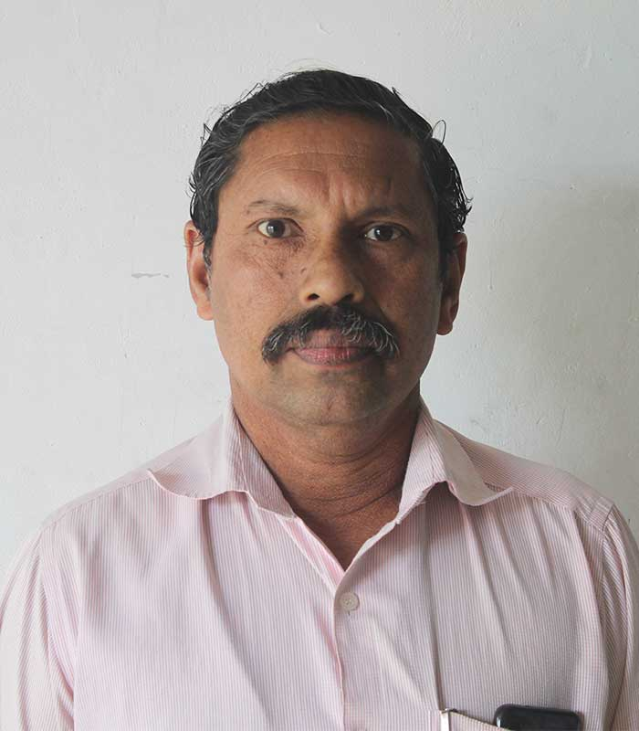
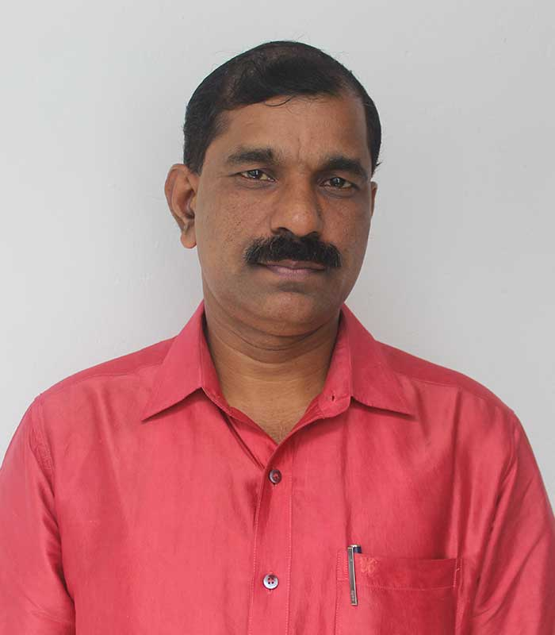

| Sl.No. | Name | Designation | Experience | Photo |  
|--------|---------------------|-----------------------|------------------|-------|
| 1 | Saji K Vettathu | Librarian Gr I | 22 Yrs 11 Months |   |
| 2 | Baiju S | Librarian Gr I | 22 Yrs  |   |
| 3 | Animon K K | Librarian Gr III | 12 Yrs 7 Months |   |
| 4 | Bili K Nair | Junior Superintendent | 20 Yrs 10 Months |   |
| 5 | Binu Zacharia | Assistant Gr I | 19 Yrs 7 Months |   |
| 6 | Sabitha M.N | Assistant Gr II | 17 Yrs 6 Months |   |
| 7 | Anoop Chandran V | Assistant Gr II | 12 Yrs 3 Months |   |
| 8 | Sunil Kumar. E S | Clerical Assistant | 21 Yrs 1 Months |   |
| 9 | Sabu P.L | Peon | 21 Yrs 01 Months |   |
| 10 | Shajimon Joseph | Peon | 20 Yrs  |   |
| 11 | Rajesh Kumar K R | Driver Cum Attender | 9 Yrs |   |
| 12 | Sheela M J | Full Time Sweeper | 17 Yrs 10 Months |   |
| 13 | Sindhu C S | Full Time Sweeper | 8 Yrs 7 Months |   |
