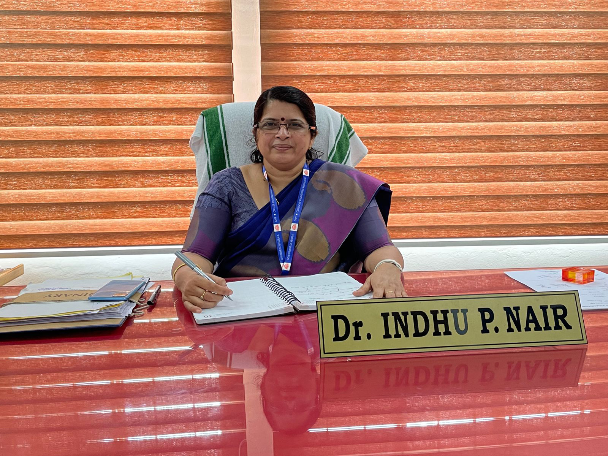

## Dr. INDHU P NAIR

Principal, College of Engineering Kidangoor.

Area of Specialisation: Electrical Engineering.

<!--[Profile](PrincipalProfile.pdf) -->

**Education Summary**

* Ph.D- Electrical Engineering – University of Calicut.2018.
* M.Tech- Control & Instrumentation(First Rank) – NIT Calicut,2001.
* B Tech- NSS College of Engineering Palakkad,1996.

**Experience Details**

1. Principal - College of Engineering Kidangoor – 01/06/2023 till date.
   
   
2. Principal - College of Engineering Aranmula – 20/10/2021 - 30-05-2023
   
   
3. Associate Professor and HoD- Department of Electrical & Electronics Engineering –  College of Engineering Kidangoor – 6/2/2006- 19/10/2021.
   
   
4. Lecturer(Senior Scale), Department of Electrical & Electronics Engineering, NSS College of Engineering Palakkad – 2/11/2002-5/2/2006.
   
   
5. Lecturer, Department of Electrical & Electronics Engineering, NSS College of Engineering Palakkad – 2/11/1998 -1/11/2002.   

