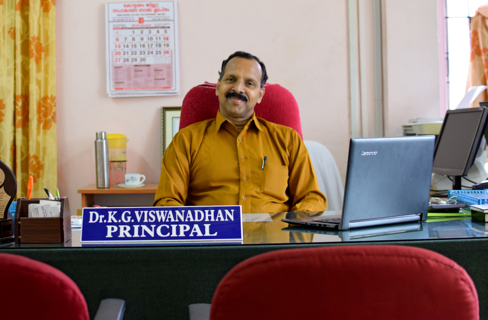

### Dr. K G Viswanadhan

Principal, College Of Engineering Kidangoor.

Area of Specialisation: Mechanical Engineering, Production Engineering

**Education Summary**

* Ph.D in Quality Engineering & Management form IISc Bangalore
* M.Tech in Production Engineering from PSG College of Technology, Coimbatore
* B.Tech in Mechanical Engineering from M A College of Engineering, Kothamangalam

###### Additional Qualification

* MBA from Bharathiar University, Coimbatore
* PGDCA from Bharathiar University, Coimbatore
* MCA from Bharathiar University, Coimbatore

###### Experience details

18/02/2015 to Till Date Principal

01/01/2009 to 17/02/2015 Professor

01/01/2006 to 31/12/2008 Associate Professor

01/06/2000 to 31/12/2005 Selection grade lecturer

01/06/1995 to 31/05/2000 Senior Lecturer

01/06/1989 to 31/05/1995 Lecturer
