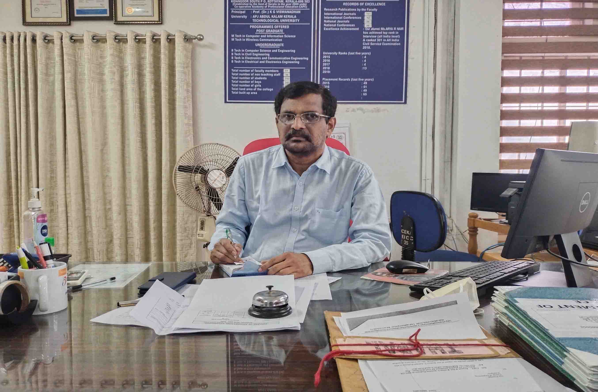

### Dr. B V Mathew

Principal, College of Engineering Kidangoor.

Area of Specialisation: Civil Engineering - Engineering Education.

<!--[Profile](PrincipalProfile.pdf) -->

**Education Summary**

* Ph.D in Civil Engineering-Engineering Education from Madras University.
* M.Tech in Civil Engineering from IIT Madras.
* B.Tech in Civil Engineering from Govt. Engineering College Thrissur.

**Experience Details**

03/03/2022 to Till Date Principal

24/03/2009 to 20/10/2009 Professor

01/09/2006 to 03/03/2022 Professor

01/06/2005 to 03/01/2022 Head of Department

15/07/2002 to 31/08/2006 Associate Professor

08/08/1988 to 13/07/2002 Lecturer
