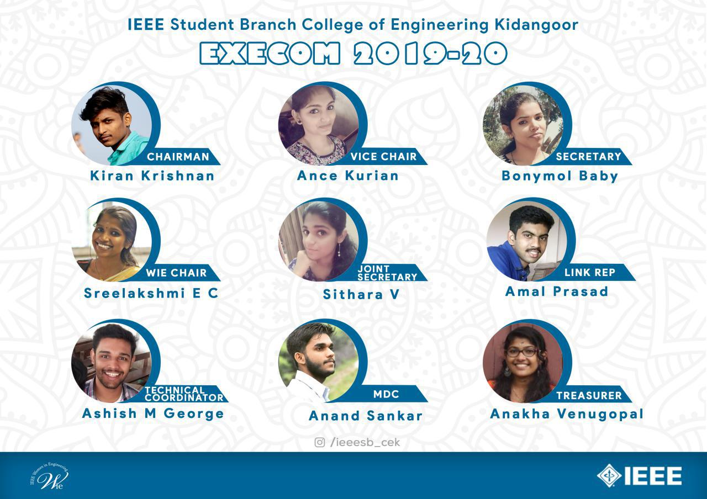

IEEE is the world’s largest technical professional organization dedicated to advancing technology for the benefit of humanity. IEEE’s core purpose is to foster technological innovation and excellence for the benefit of humanity. IEEE will be essential for the global technical community and to technical professionals everywhere, and be universally recognized for the contributions of technology and technical professionals in improving global conditions. IEEE and its members inspire a global community to innovate for a better tomorrow through its more than 420,000 members in over 160 countries, and its highly cited publications, conferences, technology standards and professional and educational activities. IEEE is the trusted “voice” for engineering computing and technology information around the globe.

###About IEEE student branch College of Engineering Kidangoor

College of Engineering, Kidangoor (CEK) is one among the premier institutions in the state. The college is governed by the Co-operative Academy for Professional Education established by Government of Kerala. The institution glistens with outstanding records in academic and extracurricular fields backed by excellent faculty and full fledged facilities.
The IEEE Student branch College of Engineering, Kidangoor, which started its journey from the year 2004, aims to enhance and create technical and professional opportunities for the students. The student branch, through the immense support from faculty and students stays active throughout, every year.
The student branch belongs to Region 10, India Council, Kerala section, Kochi Hub of IEEE and supports all its activities with a high degree of pleasure and satisfaction. Since 2004, the branch does play a mighty role in developing the management and coordination skill of its members through various events organized at the SB and Hub levels. The SB of the college has been actively organizing technical talks, workshops and seminars to keep the students in pace with the advancement in latest technology.

####IEEE Synergio
Synergio  is   all Kerala level technical event hosted by IEEE Student Branch, College of Engineering ,Kiadangoor.It is a sincere effort to provide a fruitful experience to all those who wish to explore their areas of interest. The event generally comprises of exciting technical workshops handled by experts in the field.
The event is an opportunity for the participants to exchange their idea, gain extra knowledge and to interact with similar minded peers and professionals for future collaboration.

####Achievements
**Anand PS**
IEEE Kochi Hub Technical Coordinator 2017
IEEE LINK Electronic Communications Coordinator 2019

**Abhishek Bijoy**
IEEE LINK Electronic Communications Coordinator 2019
Keralarescue.in founding volunteer

**Kiran Krishnan**
IEEE ComSoc Kerala Chapter Design Lead
