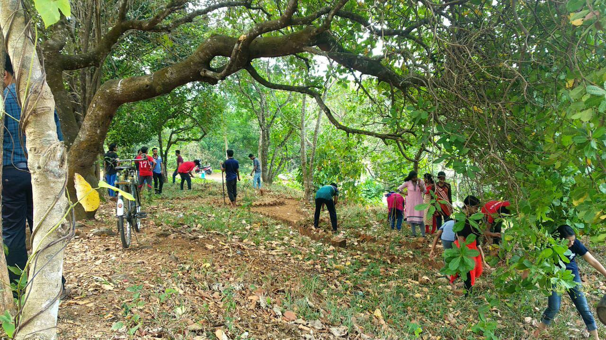
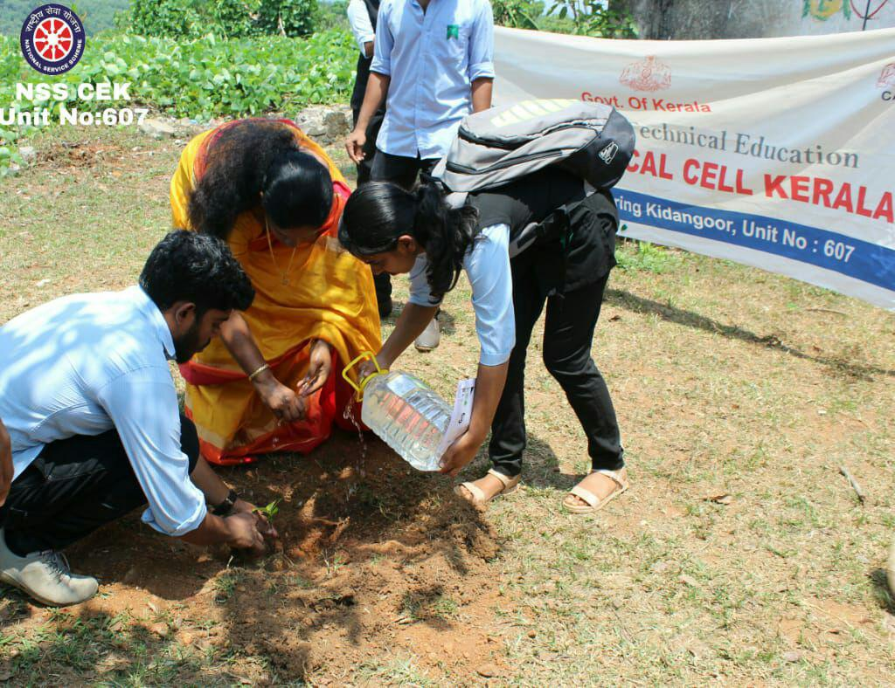
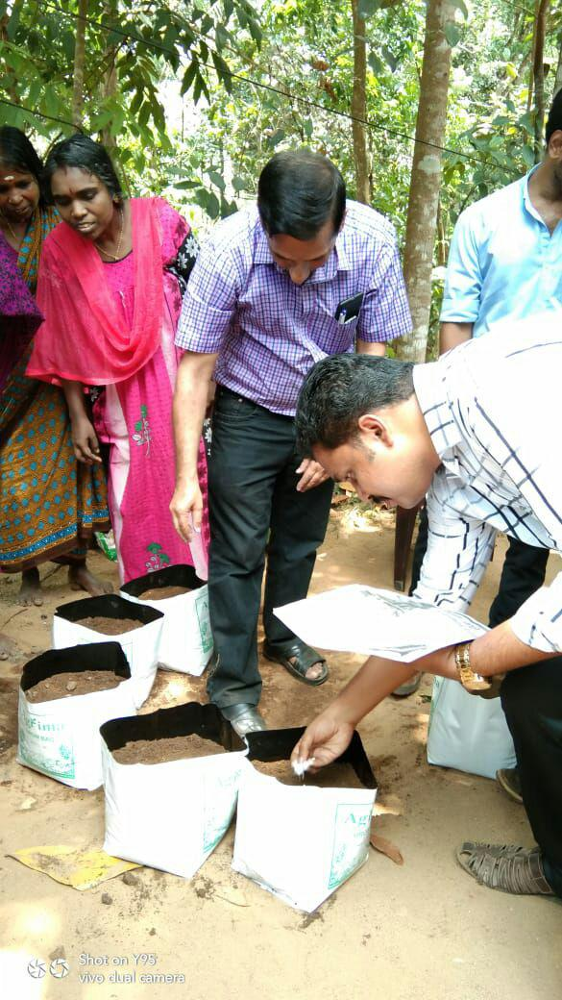
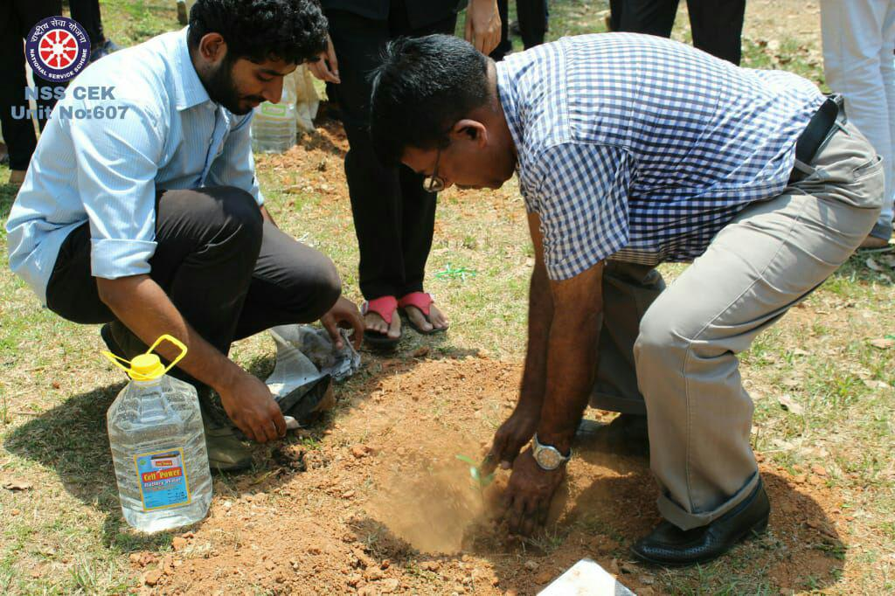
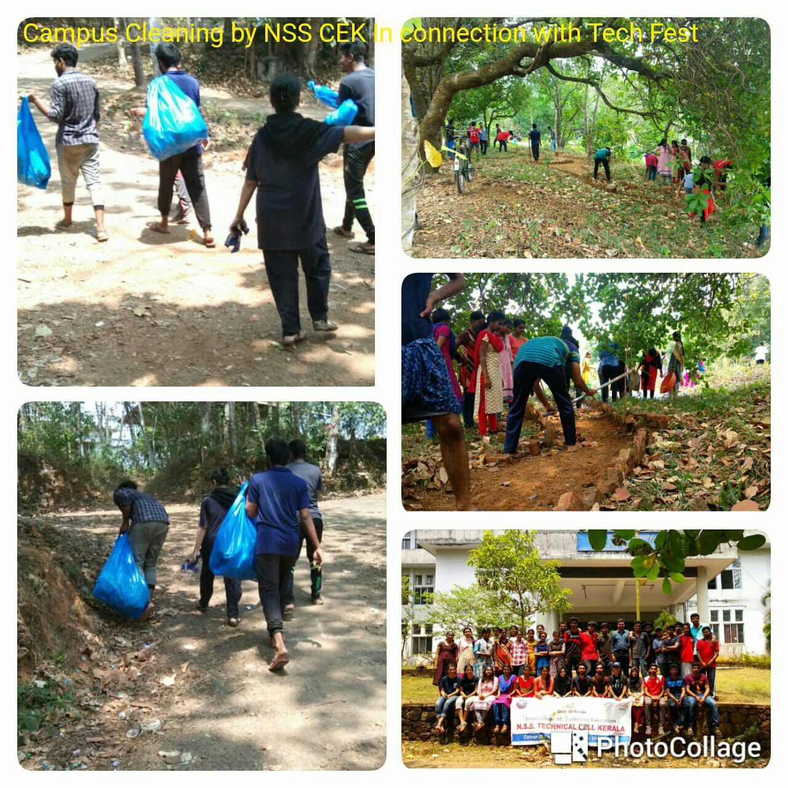
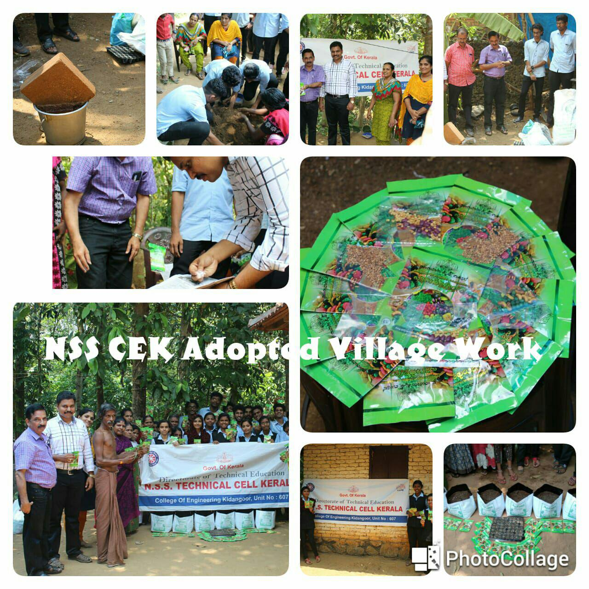
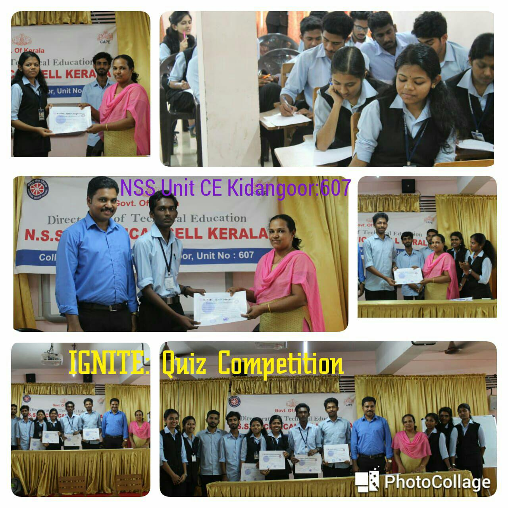
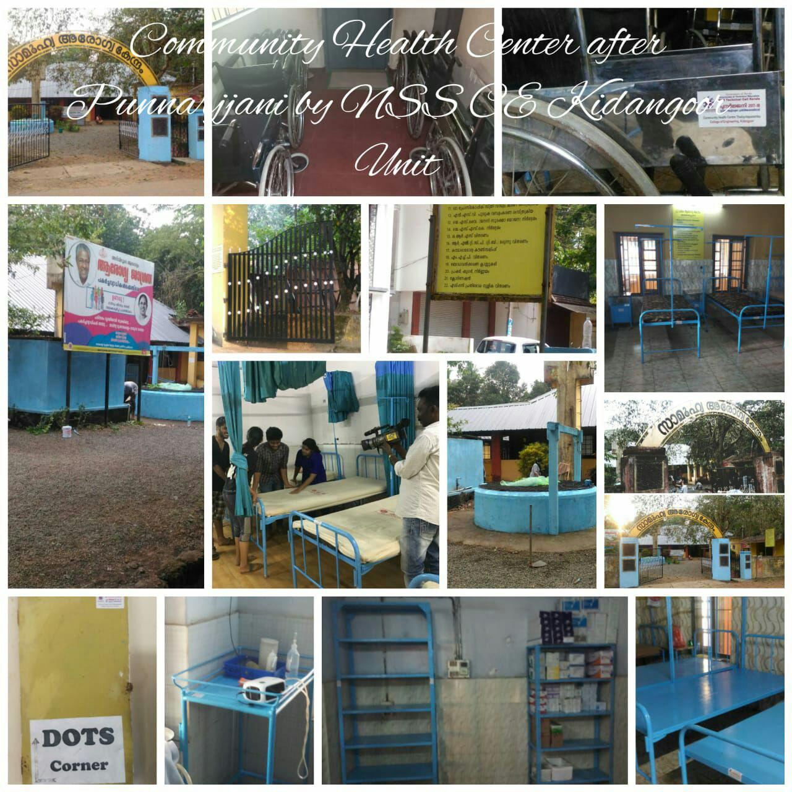

National Service Scheme (NSS) was constituted in 1969, the year which marks Mahatma Gandhi’s 100th Birthday, as a student youth service programme. It is an educational experiment in community service which aims at involving under-graduate students on a voluntary basis in various activities of social service and national development, students to understand and appreciate the problems of the community, awaken social consciousness and inculcate in them a sense of dignity of labour. The Motto of NSS “Not Me But You”, reflects the essence of democratic living and upholds the need for self-less service. NSS helps the students develop appreciation to other person’s point of view and also show consideration to other living beings. The philosophy of the NSS is well reflected in this motto, which underlines on the belief that the welfare of an individual is ultimately dependent on the welfare of the society on the whole and therefore, the NSS volunteers shall strive for the well-being of the society.

[row]
[col]

[/col]
[col]

[/col]
[/row]
[row]
[col]

[/col]
[col]

[/col]
[/row]

College of Engineering Kidangoor Unit 607 is a self financing unit under NSS technical cell and APJAKTU Technical Cell . The NSS Unit of our college places an active role in shaping our students human and responsible citizens. Now NSS Activities are included in the academic curriculum so that students are exposed to more opportunities for social services. The NSS unit of College of Engineering Kidangoor is a very socially active body which upholds the NSS motto of “NOT ME BUT YOU” and enables the students to remain connected with the society and updated about their problems. The main aim of the unit is PERSONALITY DEVELOPMENT THROUGH SOCIAL SERVICE and to nurture a group of socially committed professionals. Several social welfare programmes such as rural camps, annual special camps, health camps, blood donations camps, various awareness programmes for students and the public, marathons, etc. are organised by the NSS unit of CEK regularly..Mainly NSS unit of College of Engineering Kidangoor focuses on the rural reconstruction activities at our adopted village KUREEKATIL COLONY also.
