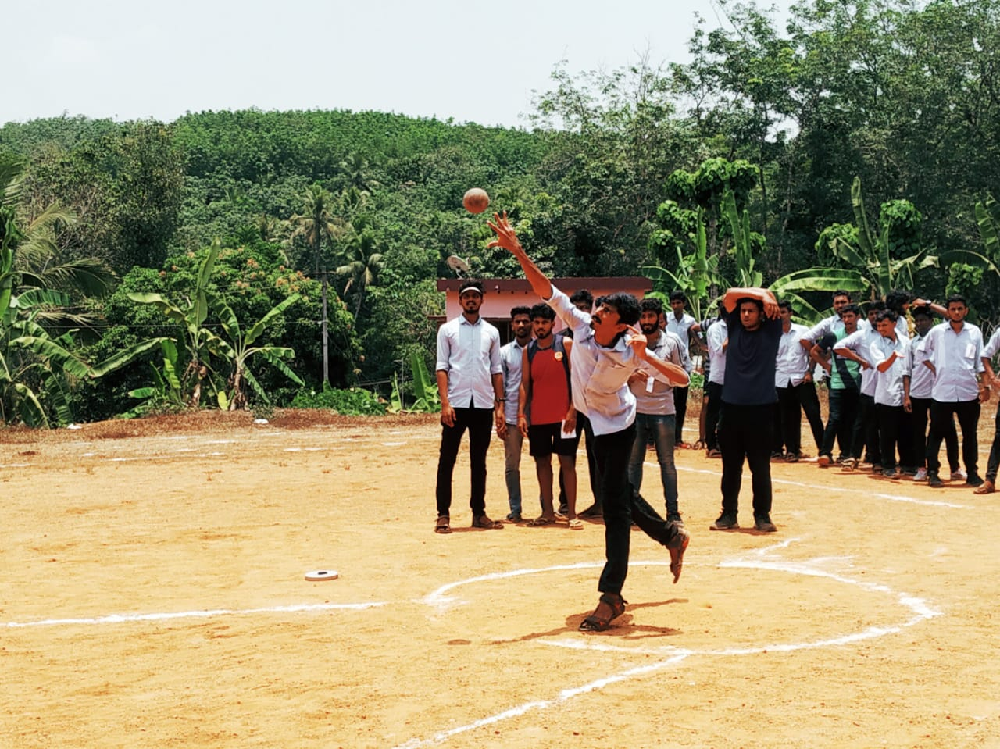
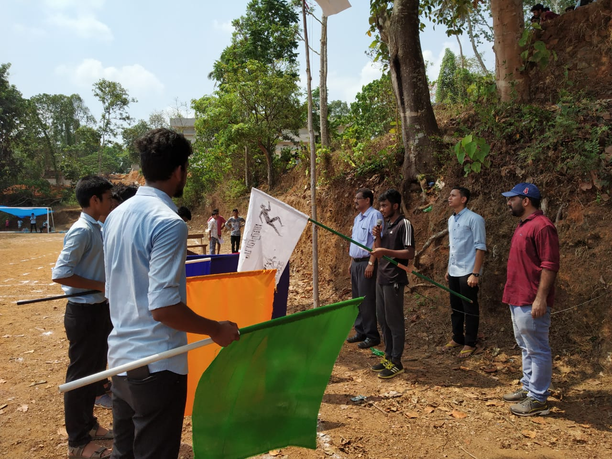
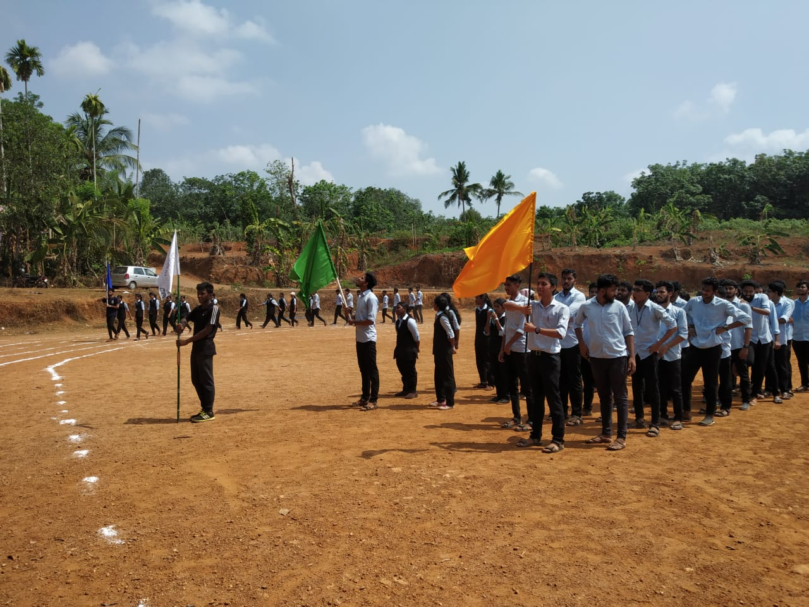
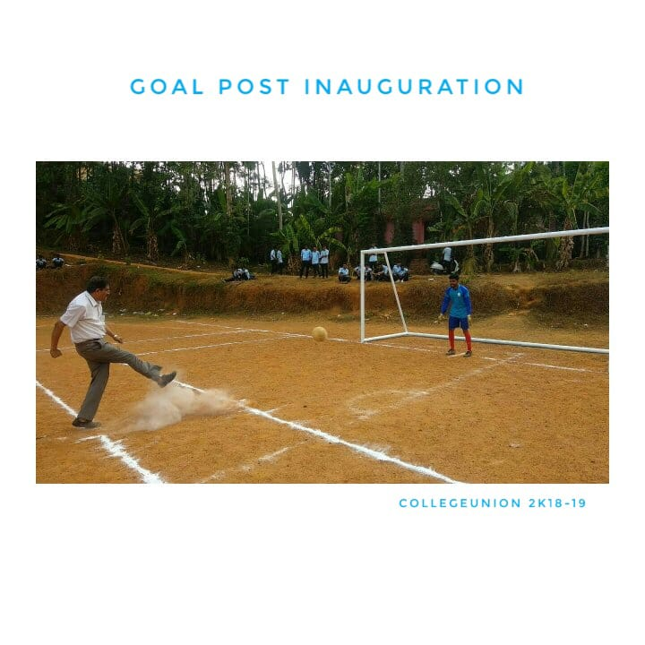

Physical education is an integral part of any
educational programme, which is designed to promote the optimum
development of an individual - physically, emotionally, mentally,
society and spiritually through total body movement in the performance
of properly selected physical activities.

The primary aims of physical education is varied,
based on the needs of the time and place. Most of the institutions goal
is to provide students with knowledge, skills, capacities, values, and the
enthusiasm to maintain a healthy lifestyle into adulthood. Activities
included in the programme are designed to promote physical fitness, to
develop motor skills, to instill knowledge and understanding of rules,
concepts, and strategies or as individuals in a wide variety of
competitive activities.

The Department of Physical Education at CEK is well
equipped with modern infrastructure and includes activities like a green
sports ground encompassing a 300 meter. Athletic track, Football and
cricket fields, a separate facility volleyball is also setup. Four Shuttle
Badminton courts are maintained for both men and women. A wellequipped-
gymnasium facility is available for both men and women and
also have indoor game facilities such as Caroms, Chess etc.

###<u>PHYSICAL EDUCATION DAILY ACTIVITIES</u>

In order to enhance and promote sports interest among
the students, the Department of Physical Education promotes daily
sports and fitness activities. A fully equipped gymnastic functions in
the morning and evening for both staff and students. other sports
activities like cricket, Football, Shuttle Badminton and volleyball are
played daily by the students from 4.20 to 6.30 pm. Equipment for these
are constantly updated and provided by the Department.

###<u>PARTICIPATION IN KTU GAMES</u>

Under initiative of the Physical Education Department
of CEK, college teams were sent to participated in various sports events
organized by KTU in the present academic year. Men's and women's
Badminton teams participated in the inter collegiate Badminton
Tournament and the women's team were the winners. College teams
also participated in inter collegiate Football, Volleyball and cricket.
Competition and offered tight matches for the opponents.

###<u>FACILITIES</u>

| Sl.No 	| Play Ground 	| Number 	|
|:-----:	|:---------------:	|:------:	|
| 1 	| Football 	| 1 	|
| 2 	| Cricket Field 	| 1 	|
| 3 	| Volleyball 	| 1 	|
| 4 	| Badminton Court 	| 4 	|
| 5 	| 30mtr. Track 	| 1 	|
| 6 	| Gymnasium 	| 1 	|

<!-- 
[row]
[col]

[/col]
[col]

[/col]
[/row]
[row]
[col]

[/col]
[col]

[/col]
[/row] -->

