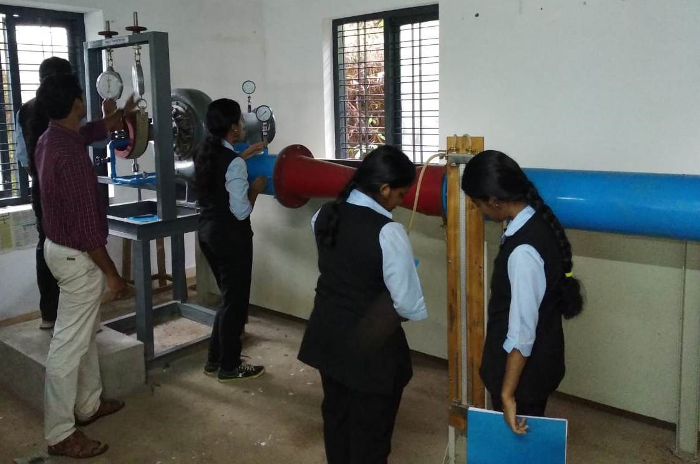

### Lab details

- **Transportation Engineering Laboratory**

The Transportation Engineering Laboratory is equipped with facilities for testing of Aggregates and Bitumen. The Laboratory is fully equipped for conduct regular experiments at UG level, consultancy works and research activities.
The laboratory is facilitated with ring and ball apparatus, Aggregate impact testing machine, shape test apparatus, ductility testing machine, Standard tar viscometer, Los Angeles Abrasion testing machine, Flash and fire point apparatus, Universal penetrometer, Marshall stability apparatus etc.

- **Geo-Technical Engineering Laboratory**

It is well equipped with instruments and machineries for conducting laboratory tests and undergraduate students are being encouraged to do research in the field of geotechnical engineering by making use of facilities available.
The equipments in the geotechnical lab is used to determine the physical properties,  strength, compressibility and permeability of soil.
The laboratory is equipped with Field density testing apparatus, Permeability testing   apparatus ,CBR testing apparatus, Consolidation testing apparatus, Direct shear test  apparatus, Atterberg Limits testing apparatus, Soil Hydrometer , proctor compaction   testing apparatus etc.
Consultancy work from the government, semi government and private agencies are  undertaken. Soil investigation for various projects in Kottayam district is conducted in Geotechnical Engineering lab.

- **Fluid Mechanics and Hydraulic Machines Lab**

The activities in this laboratory are focused on the physical understanding, modeling and manipulation of flows and their instabilities.
The main objective of this laboratory is that, student should be able to verify the principles studied in theory by conducting the experiments
The laboratory is facilitated with pipe friction apparatus, Bernoullis apparatus, Pelton turbine, Francis turbine, Venturimeter and orifice meter, Keplan turbine , notch apparatus etc.

- **Survey Lab**

Here practical lessons on surveying theory are provided. Starting from the old metric chains to latest total station are provided in the lab. The various instruments/equipments include plane table, automatic level, prismatic compass, theodolite, electronic theodolite, GPS ,Total Station etc.

- **Materials Testing Lab**

This lab is well equipped for testing structural materials including steel, timber, concrete etc., and has a 40 T  UTM, 100 T and 200 T compression testing machine, Double shear test apparatus, Impact testing machine, torsion testing machine etc. Standard tests are routinely performed for Government and Private Organizations.

- **Concrete  Lab**

This lab provides facilities for various tests for cement and concrete which includes test for compressive strength, flexural strength, fineness, and mix design of concrete etc.
This laboratory is actively involved in consultancy work for various Government and Non government organizations.
        The laboratory is facilitated with hot air oven, Vicat apparatus etc.

- **Computer Aided Design Lab**

A well-equipped computer lab with advanced facilities is established for the benefit of the Civil Engineering students. Advanced Civil Engineering software  is procured for making the students globally competitive and industry ready. At CAD lab, students get professional training on AutoCAD software, STAAD and PRIMEVERA. Here students will gain the knowledge of design, drafting and project management needed for Civil Engineering graduates.

- **Environmental Engineering Lab**

This lab is mainly intended for qualitative and quantitative analysis of the characteristics of water and waste water. Laboratory is well equipped to conduct experimental studies in U G program as well as to encourage students to do research in the field of Environmental Engineering
The laboratory is facilitated with hot air oven, Jar test apparatus, Distillation unit, Muffle furnace, pH meter, turbidimeter, water bath, Potable water quality analyzer etc.

- **Non Destructive Testing Laboratory**

Non-destructive testing (NDT) is the process of inspecting, testing, or evaluating materials, components or assemblies for discontinuities, or differences in characteristics without destroying the serviceability of the part or system. In other words, when the inspection or test is completed the part can still be used.
The laboratory is facilitated with Anemometer, Ultrasonic Pulse velocity meter, Rebound hammer, Penetrometer, Hygrometer, Lux meter , Digital thermometer etc.

- **Basic Civil Engineering Workshop**

This lab is intended to conduct the practical sessions of the first year B-Tech students. Training sessions like Setting out of building, Area and Volume calculation of building and building components, making of brick bonds and basics surveying using levelling instruments are conducted by using this lab facility.
