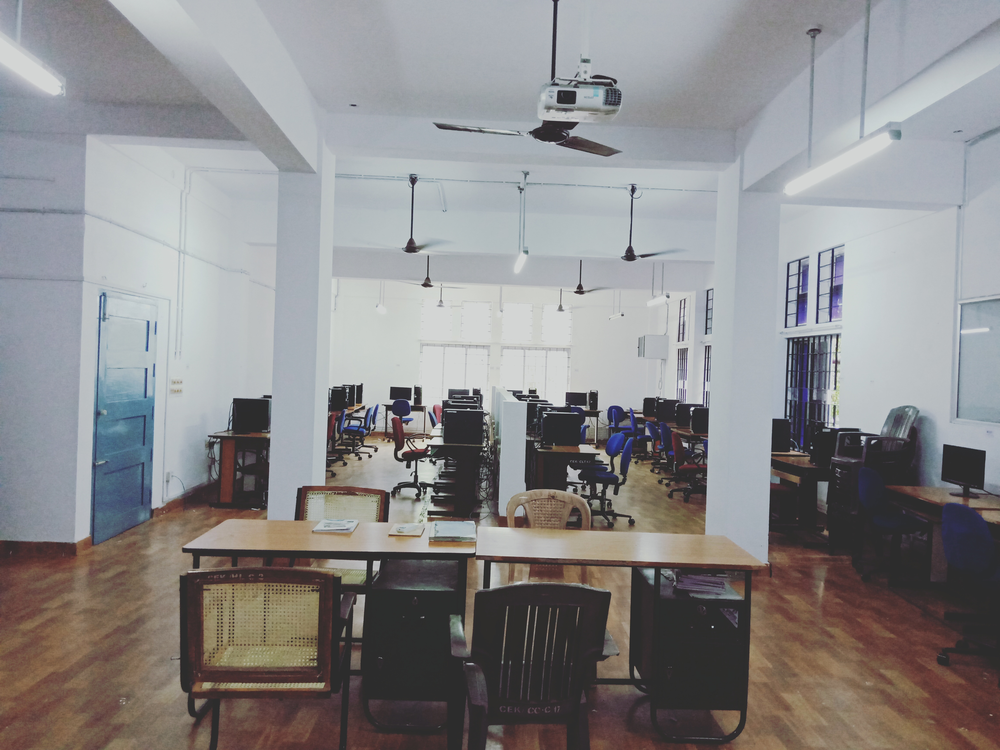
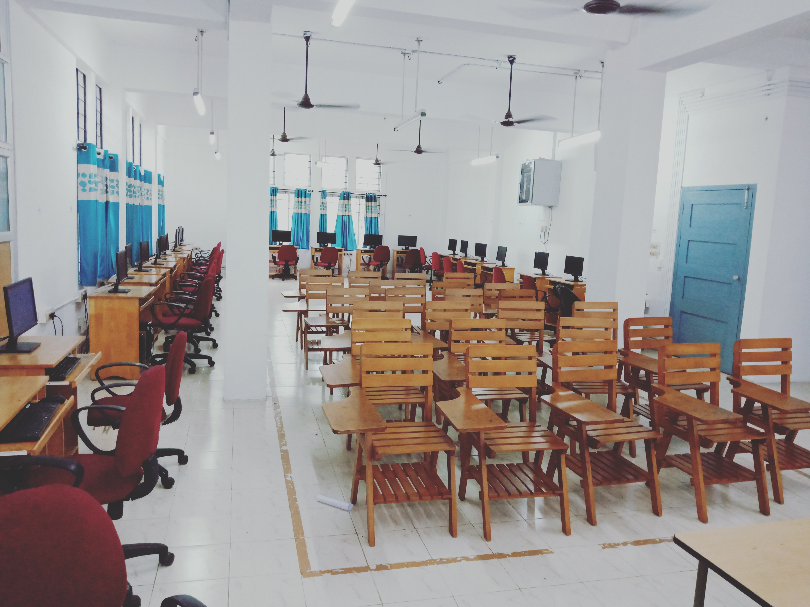
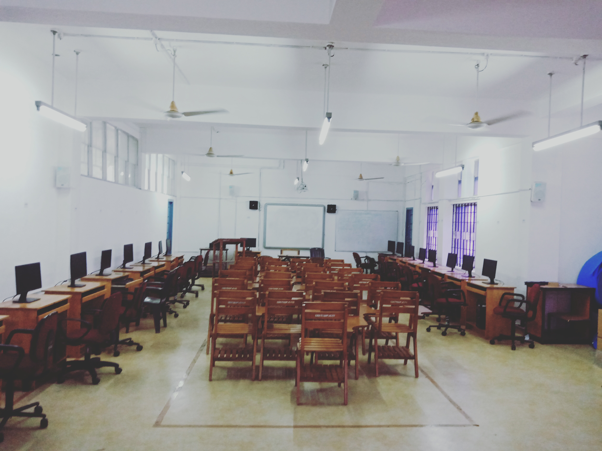
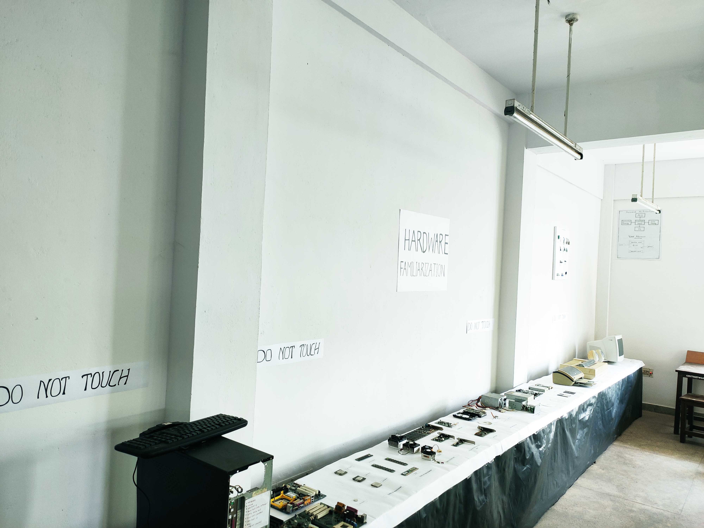
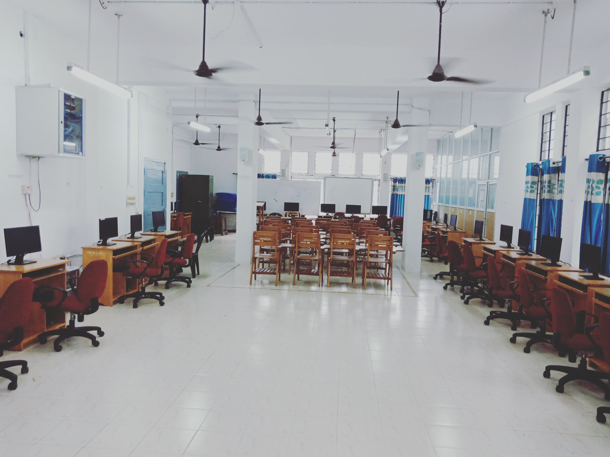
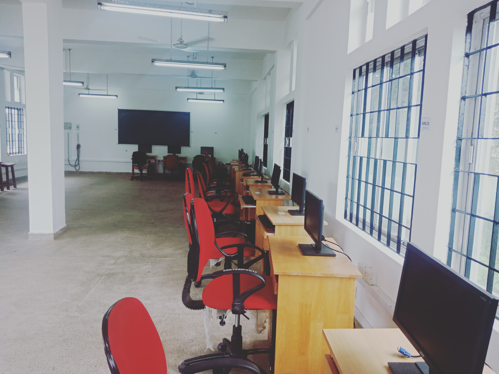

###Programmes Offered
 

###### 1. Bachelor in Technology, Computer Science.

- Seats Available : 90

###### 2. Masters in Technology, Computer & Information Sciences.

- Seats Available : 18

 

### Program Educational Objectives (PEO)
Graduates of Computer Science and Engineering at College of Engineering Kidangoor are expected to:
- **PEO1**- **Have sound knowledge** and technical skills required to remain productive in the field of Computer Science and Engineering.
- **PEO2**- **Be efficient team leaders**, effective communicators and successful entrepreneurs.
- **PEO3**- **Resolve technical problems** with a positive outlook towards well-being of the society.
- **PEO4**- **Function in diverse environments** with the ability and competence to solve challenging problems.
- **PEO5**- **Pursue lifelong learning** and professional development through higher education.

 

###Program Outcomes
- **Engineering knowledge:** Apply the knowledge of mathematics, science, engineering fundamentals, and an engineering specialization to the solution of complex engineering problems.
- **Problem analysis:** Identify, formulate, review research literature, and analyse complex engineering problems reaching substantiated conclusions using first principles of mathematics, natural sciences, and engineering sciences.
- **Design/development of solutions:** Design solutions for complex engineering problems and design system components or processes that meet the specified needs with appropriate consideration for the public health and safety, and the cultural, societal, and environmental considerations.
- **Conduct investigations of complex problems:** Use research-based knowledge and research methods including design of experiments, analysis and interpretation of data, and synthesis of the information to provide valid conclusions.
- **Modern tool usage:** Create, select, and apply appropriate techniques, resources, and modern engineering and IT tools including prediction and modeling to complex engineering activities with an understanding of the limitations.
- **The engineer and society:** Apply reasoning informed by the contextual knowledge to assess societal, health, safety, legal and cultural issues and the consequent responsibilities relevant to the professional engineering practice
- **Environment and sustainability:** Understand the impact of the professional engineering solutions in societal and environmental contexts, and demonstrate the knowledge of, and need for sustainable development.
- **Ethics:** Apply ethical principles and commit to professional ethics and responsibilities and norms of the engineering practice
- **Individual and team work:** Function effectively as an individual, and as a member or leader in diverse teams, and in multidisciplinary settings.
- **Communication:** Communicate effectively on complex engineering activities with the engineering community and with society at large, such as, being able to comprehend and write effective reports and design documentation, make effective presentations, and give and receive clear instructions.
- **Project management and finance:** Demonstrate knowledge and understanding of the engineering and management principles and apply these to one’s own work, as a member and leader in a team, to manage projects and in multidisciplinary environments.
- **Life-long learning:** Recognize the need for, and have the preparation and ability to engage in independent and life-long learning in the broadest context of technological change.
 

### Program Specific Outcomes (PSO)
- **PSO1**- Ability to appreciate, learn and develop applications using modern programming languages, and databases.
- **PSO2**- Ability to understand and analyze computer networks, distributed systems and computer system architectures for the designing of  new systems. 
- **PSO3**- Ability to apply knowledge of domains like  machine learning, cloud computing , image processing, data mining and software engineering to tackle innovative problems. 

### Lab Details
 

[box]
[fl width='500']

[/fl]
**Basic Computational Lab**

Basic Computational lab has 36 computers to do basic and core programming labs of the curriculum. The lab is having power backup by 2 Nos of 5 KVA UPS. A Major course handled in this laboratory is data structure lab which teaches students on implementation of the data structure concepts. Data structure implementations are done using C and Java programming languages. Another major course is the Network OS lab where the students practice the ideas on network and operating systems which they have learned in theory. The lab also provides facility to practice Django framework of python.

[/box]

[box]
[fl width='500']

[/fl]
**Multimedia Lab**

Multimedia lab has 35 computers of latest configuration with 2Nos of 5 KVA UPS.  This lab provides platform for training the students on the lab courses of database, compiler. Students practice data base concepts in this lab using MySQL. Working of the compilers are taught in the compiler lab with the help of Lex and YACC softwares. This lab also has python based tools to practice machine learning.

[/box]

[box]
[fl width='500']

[/fl]
**Image Processing Lab**

 Image processing lab has 22 computers with i5 based processors and is supported by a 10KVA UPS. The major lab course provided in the lab are image processing for the M.Tech students, database lab for B.Tech CSE students. M.Tech students use the MATLAB software to practice the image processing concepts. Oracle database is used by the students to practice data base concepts in this lab.

[/box]

[box]
[fl width='500']

[/fl]
**P.C. Hardware Lab**

PC Hardware lab is meant to provide hardware related training to students of the programme. This involves introducing and familiarization of various hardware components. This lab enables students to understand the working and troubleshooting of computers. In addition, microprocessor (8086) and microcontroller (8051) programming familiarization and related experiments are also conducted in the lab.

[/box]

[box]
[fl width='500']

[/fl]
**Cloud Computing Lab**

Cloud computing lab is having 15 systems and NAS facility for training students in the cloud computing domain. Students use this facility to do cloud related projects. In addition this facility is also used to run the Web Application Development laboratory for IT students. Building and troubleshooting the front end and back end of web application are taught in this lab.       

[/box]

[box]
[fl width='500']

[/fl]
**Research & Project Lab**

This lab has got 18 systems with one 5 KVA UPS. The lab is mainly used by the M.Tech students for their regular labs and research work. This lab is also used for the B.Tech projects.
[/box]
