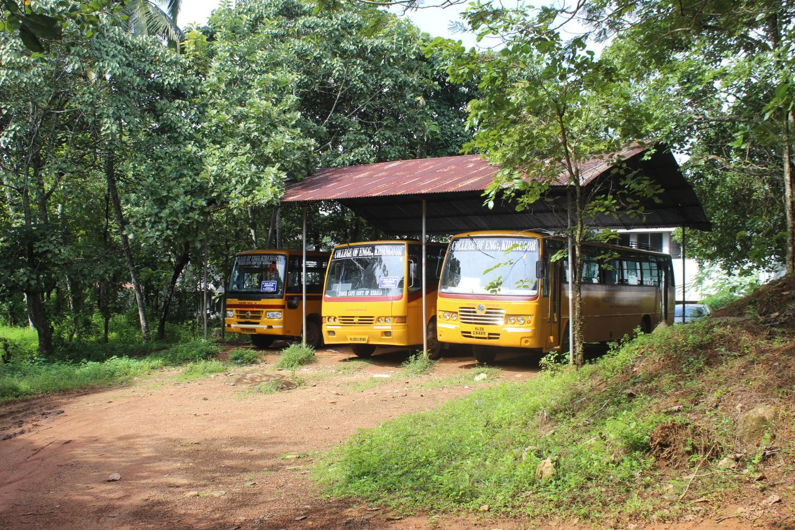

The college has a regular bus service plying to and from Pala, Ettumanoor,Changanachery, Thalayolaparambu, Karukachal, Erattupetta and Kottayam town to the college premises, for the purpose of conveying students and staff conveniently. The college campus is 1.5 km away from Manthady Jn. The P.T.A College of Engineering, Kidangoor operates college buses for the use of staff and students. Three buses are also used to commute students from Manthady Jn to Campus. The students of this college and their parents have great appreciation for the bus service.

|    Route#    |    Bus    |    Route    |    Timing    |
|--------------|---------------------------------|---------------------------------------|---------------------------------------------------------------------------------------------------------------------------------------------------------------------------------------------------------------------------------------------------------------------------------------|
|    1    |    College Bus-1    |    Changanassery - CEK    |    Changanassery (Head postoffice-7:30AM) via Chingavanam(7:45AM)   Njaliyakuzhi(7:55AM), Kaithepalam(08:05AM), Puthuppally(08:10AM) Manarcadu(08:15AM),   Ayarkunnam(08:30AM), CEK(8:45AM)   Return 04:15 PM (Mon-Thu), 04:45PM (Fri)    |
|    2    |    College Bus-2    |    Kottayam - CEK    |    Kottayam (7:50AM),   Kumaranallor (08:00AM), Sankranthi (08:05AM), Ettumanoor(08:10AM),   Thiruvanchoor (08:20AM), Ayarkunnam (08:30AM), Manthadi (8:40AM), CEK(08:45AM)   Return 04:15 PM (Mon-Thu), 04:45PM (Fri)    |
|    3    |    College Bus-3    |    Poonjar - CEK    |    Poonjar (7:50AM),   Erattupettah(08:08AM), Bharananganam (08:15AM), Pala (08:25AM) , Mutholi (08:30AM), Cherpunkal (08:35AM), Kidangoor(08:40AM),   CEK(08:45)   Return 04:15 PM (Mon-Thu), 04:45PM (Fri)    |
|    4    |    College Bus-4    |    Karukachal - CEK    |    Karukachal (7:45AM),   Panpady (08:00AM), Kodungoor (08:15AM), Pallikkathodu (08:30AM), Mattakkara(08:40AM),   CEK(08:45)   Return 04:15 PM (Mon-Thu), 04:45PM (Fri)    |
|    5    |    College Bus-5    |    Thalayolaparambu - CEK    |    Thalayolaparambu (Private Bus Stand-7:45AM),   Kaduthuruthy(08:00AM), Kuravilangad (08:10AM), Vempally (08:20AM), Vayala (08:30AM), Kidangoor(08:35AM),   CEK(08:45)   Return 04:15 PM (Mon-Thu), 04:45PM (Fri)    |
